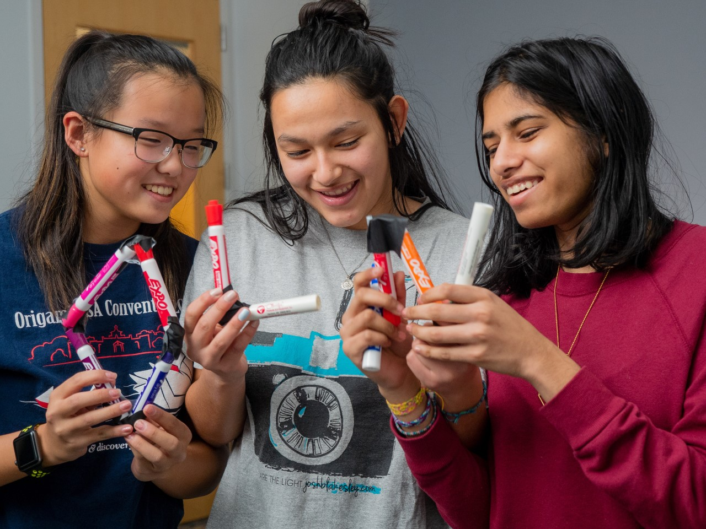

	<a href="https://18chowdhary.github.io/CandidatesWeekendGuide/">Home</a>
	<a href="https://18chowdhary.github.io/CandidatesWeekendGuide/overview">Overview</a>
	<a href="https://18chowdhary.github.io/CandidatesWeekendGuide/evolution">Evolution</a>
	<a href="https://18chowdhary.github.io/CandidatesWeekendGuide/results">Results</a>
	<a href="https://18chowdhary.github.io/CandidatesWeekendGuide/implementation">Implementation</a>
	<a href="https://18chowdhary.github.io/CandidatesWeekendGuide/ethics">Impact</a>
	<a href="https://18chowdhary.github.io/CandidatesWeekendGuide/about" class="active">About Us</a>
 

# About Us

## The Team

 

We are a group of students at Olin College of Engineering. We designed this web app for the betterment of our college. This project also serves as our final deliverable for the class Software Design. All of us have strong interests in software and wanted to use our skills to give back to the college we love.

When Megan "Meg" Ku isn't coding, she can be found folding origami, getting "buff", or singing in the Olin PowerChords a cappella group. She has enjoyed working on this project with two of her great friends and contributing to the college in a positive way.  As an OVAL tour guide, she is very excited to see this app used by prospective and admitted students in the future.

Hailing from the great state of Texas, Kristin Aoki has diverse interests, ranging from community service to baking. She hasn't declared which focus within engineering she'd like to concentrate on, but she is enjoying the software and design aspects of this project.

Shreya Chowdhary has been interested in computing since high school, and has recently grown especially interested in leveraging technology to create a better world. She is involved in Olin College's Public Interest Technology Community (PInT) and a member of Olin's volunteerism group, SERV. She is also deeply interested in engineering education and explores the nature of engineering education as an education researcher. During her (admittedly spare) free time, she can be found  either listening to/crafting podcasts or writing/reading (especially plays, poetry, and diverse books).

## Attributions

Photos: Olin College of Engineering - Office of Admissions and Financial Aid and Department of Marketing and Communication.

Fonts: Olin College of Engineering - Department of Marketing and Communication

Social Media Buttons: https://www.w3schools.com/howto/howto_css_social_media_buttons.asp
